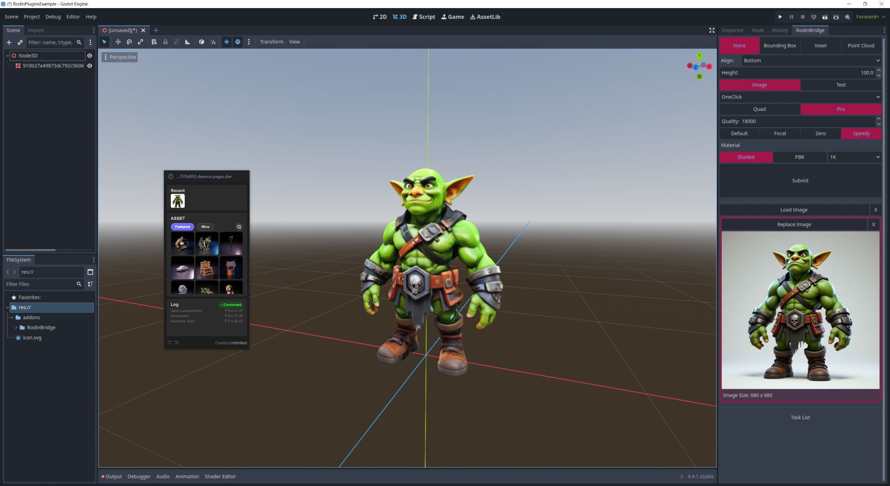

# Godot-Rodin-Plugin

## Rodin - 3D model generation
Join us to witness one of the most advanced 3D model generation AI technologies ever - Rodin, a controllable large-scale generative model for creating high-quality 3D assets!

With just a few words or a picture, Rodin transforms your imagination into realistic CG-friendly 3D models with photorealistic material rendering! This project implements Rodin's generative function calls based on API requests, so you can easily transform your imagination into Godot-supported mesh and material assets, preview them in real-time, and use them as a basis to start your great creations!

Follow us on twitter [@deemosTech](http://twitter.com/deemosTech) to learn more about Rodin.

## RodinBridge
### Introduction
The Rodin Bridge for Godot is a powerful integration tool that supports most of the functions available on [Rodin's webpage](https://hyper3d.ai), allowing users to access image-based generation capabilities directly within the Godot editor environment. It enables users to replace target images, adjust generation settings, utilize ControlNet with selected objects, and choose between automatic and manual generation modes—all while maintaining a seamless workflow between Blender and the Rodin web interface through the convenient floating window functionality.

### Installation

**Requirements**

Godot ≥ 4.4
\
Google Chrome ≥ 116

**Step-by-Step Instruction**

Copy the <code>/RodinBridge</code> folder into the <code>/addons</code> folder within your Godot project. 

Then, enable RodinBridge in Project → Project Settings → Plugins.

### Basic Usage

The RodinBridge integrates most Rodin's generation functions directly in Godot. Operation requires interaction in both Godot and the Rodin webpage.

**Single Image Generation**

The Rodin webpage will automatically appear if not already open. On the Rodin webpage, activate the floating window using the toggle switch.

You can monitor the generation process in the floating window. The generated asset will be automatically imported into Godot.

You can also import featured assets or generated assets by hovering on the target asset and press the emerged **Export** button

### Advanced Functions:

**ControlNet:**

To enable ControlNet, select an object in Blender and choose your desired ControlNet mode. You can the adjest ControlNet settings as needed (Identical to Rodin webpage settings).

**Multiview Mode:**

You can use 'Add Image' to add more images as the input for generation. Rodin will automatically process them as the input for multiview generation.

**Generation Mode:**

You can choose between **One Click** mode and **Manual mode**. 

**One Click**: Process runs without step-by-step guidance.

**Manual**: Requires step-by-step operation in the floating window. The process is identical to that on Rodin webpage.

